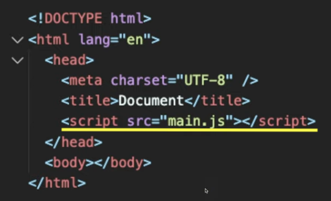
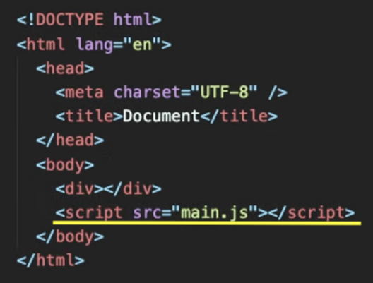
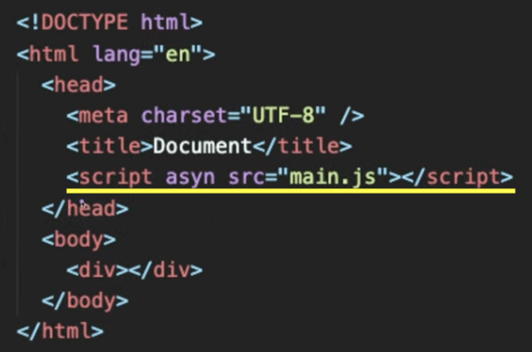
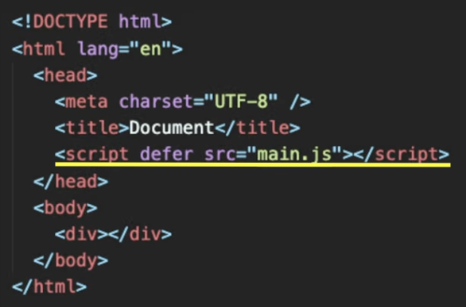

# 🚀 Passing HTML

### Web Docs [click] - [MDN Web Docs](https://developer.mozilla.org/en-US/docs/Web/JavaScript/Guide/Introduction)

```
⁃ Hello World!
⁃ Preparation
⁃ async vs defer
```



### **💡important**

> _Parsing HTML ⇢ &nbsp;&nbsp;&nbsp;&nbsp;&nbsp;&nbsp;&nbsp;&nbsp;&nbsp;&nbsp;&nbsp;&nbsp;&nbsp;&nbsp;[blocked] &nbsp;&nbsp;&nbsp;&nbsp;&nbsp;&nbsp;&nbsp;&nbsp;&nbsp;&nbsp;&nbsp;&nbsp;&nbsp;&nbsp;&nbsp;&nbsp;&nbsp;&nbsp;&nbsp;&nbsp;&nbsp;&nbsp;&nbsp;&nbsp;⇢ Parsing HTML_<br>&nbsp;&nbsp;&nbsp;&nbsp;&nbsp;&nbsp;&nbsp;&nbsp;&nbsp;&nbsp;&nbsp;&nbsp;&nbsp;&nbsp;&nbsp;&nbsp;&nbsp;&nbsp;&nbsp;&nbsp;&nbsp;&nbsp;&nbsp;&nbsp;&nbsp;`↳Fetxhing js ⇢ executing js⤴︎` &nbsp;&nbsp;&nbsp;&nbsp;&nbsp;&nbsp;&nbsp;&nbsp;&nbsp;&nbsp;&nbsp;&nbsp;&nbsp;&nbsp;&nbsp;&nbsp;&nbsp;&nbsp;&nbsp;&nbsp;&nbsp;&nbsp;&nbsp;`↑Page is ready`

**💥Problem: _User takes a long time to see a website._**
**( 🙅🏻‍♀️This is not good idea. )**

#



### **💡important**

> _Parsing HTML ⇢ Fetxhing js ⇢ executing js_ <br>&nbsp;&nbsp;&nbsp;&nbsp;&nbsp;&nbsp;&nbsp;&nbsp;&nbsp;&nbsp;&nbsp;&nbsp;&nbsp;&nbsp;&nbsp;&nbsp;&nbsp;&nbsp;&nbsp;&nbsp;&nbsp;&nbsp;&nbsp;&nbsp;&nbsp;`↑Page is ready`

**✨ User can see contents which is based on HTML before downloding ' .js'** <br>
**💥 But if the website is made almost with Javascript, the User takes a many time to see the normal website.**

#

## 🏷 Async

#### &nbsp;&nbsp;&nbsp;&nbsp;&nbsp;&nbsp;&nbsp;&nbsp;Its function is a function declared with the async keyword



### **💡important**<br>

_Parsing HTML ・・・・⇢ [blocked] ・・・・⇢ Parsing HTNL_<br>
_`↪︎Fetching js➟Executing js⤴︎`&nbsp;&nbsp;&nbsp;&nbsp;&nbsp;&nbsp;&nbsp;&nbsp;&nbsp;&nbsp;&nbsp;&nbsp;&nbsp;&nbsp;&nbsp;&nbsp;&nbsp;&nbsp;&nbsp;&nbsp;&nbsp;&nbsp;`↑Page is ready`_

**✨ An async function is a function declared with the async keyword** <br>
**💥 Before the document has been parsed, the script is not executed by executing js**

#

## 🏷 defer

#### &nbsp;&nbsp;&nbsp;&nbsp;&nbsp;&nbsp;&nbsp;&nbsp; It is a Boolean value, used to indicate that script is executed after the document has been parsed.



### **💡important**<br>

_Parsing HTML ・・・・・・・・⇢ Executing js_<br>
_`↪︎ Fetching js⤴︎`&nbsp;&nbsp;&nbsp;&nbsp;&nbsp;`↑Page is ready`_

## ⭐️ defer is the best option and safe to execute scripts ⭐️
